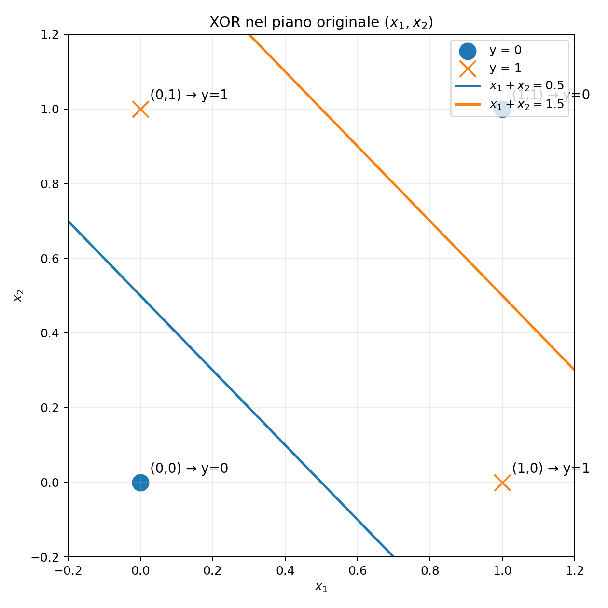
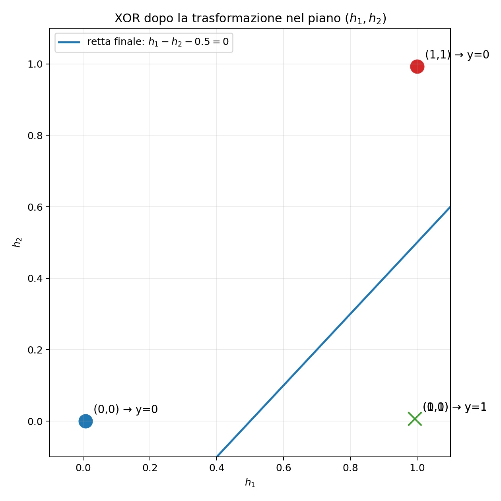

# XOR from Scratch: The Mathematics of a 2 → 2 → 1 Neural Network

This page develops, step by step, a small neural network capable of learning the **XOR** function.

The goal is not to rely on a machine-learning library, but to understand what the network is doing geometrically and mathematically. In particular, we will see how neurons, weights, biases, activation functions, loss minimization, gradient descent, and backpropagation work together.

---

## 1. The XOR problem

The XOR function is defined by the following table:

| $x_1$ | $x_2$ | $y$ |
|:---:|:---:|:---:|
| 0 | 0 | 0 |
| 0 | 1 | 1 |
| 1 | 0 | 1 |
| 1 | 1 | 0 |

In the $(x_1,x_2)$ plane, the two points with output $1$ lie at opposite corners of the unit square. The same is true of the two points with output $0$.

Consequently, no single straight line can separate the two classes. A linear neuron is therefore not sufficient to solve XOR.

The purpose of the hidden layer is to transform the original points into a new space in which the two classes **can** be separated by a single line.

---

## 2. Network architecture

We use a neural network with architecture

$$
2 \longrightarrow 2 \longrightarrow 1.
$$

It consists of:

- two inputs, $(x_1,x_2)$;
- two hidden neurons, $(h_1,h_2)$;
- one output neuron, $\hat y$.

The hidden neurons compute

$$
h_1=\sigma(w_{11}x_1+w_{12}x_2+c_1),
$$

$$
h_2=\sigma(w_{21}x_1+w_{22}x_2+c_2),
$$

while the output neuron computes

$$
\hat y=\sigma(v_1h_1+v_2h_2+c_3).
$$

The complete vector of trainable parameters is

$$
\theta=
(w_{11},w_{12},w_{21},w_{22},c_1,c_2,v_1,v_2,c_3).
$$

The network therefore has nine trainable parameters.

---

## 3. The geometric meaning of a hidden neuron

Before applying the activation function, the first hidden neuron forms the linear combination

$$
z_1=w_{11}x_1+w_{12}x_2+c_1.
$$

The equation

$$
z_1=0,
$$

or equivalently

$$
w_{11}x_1+w_{12}x_2+c_1=0,
$$

defines a straight line in the $(x_1,x_2)$ plane.

Similarly, the second hidden neuron defines

$$
w_{21}x_1+w_{22}x_2+c_2=0.
$$

The weights determine the orientation of each line, while the bias allows the line to move away from the origin.

It is important to distinguish the lines from the neuron outputs. The lines are the sets of points for which the arguments of the sigmoids are zero. The quantities $h_1$ and $h_2$ are instead the values obtained **after** the activation function is applied.

---

## 4. The sigmoid activation function

The activation function used here is the sigmoid

$$
\sigma(a)=\frac{1}{1+e^{-a}}.
$$

It maps every real number into the interval

$$
\sigma(a)\in(0,1).
$$

For a hidden neuron,

$$
z=w_1x_1+w_2x_2+c,
$$

and

$$
h=\sigma(z).
$$

The equation

$$
z=0
$$

is the neuron's threshold line.

On this line,

$$
h=0.5.
$$

On one side,

$$
z<0
\quad\Longrightarrow\quad
h<0.5,
$$

while on the other,

$$
z>0
\quad\Longrightarrow\quad
h>0.5.
$$

Far from the line, the sigmoid behaves almost like a binary indicator:

$$
h\approx
\begin{cases}
0, & \text{on one side},\\
1, & \text{on the other side}.
\end{cases}
$$

For this reason, the sigmoid can be interpreted as a **soft threshold**.

---

## 5. Transforming the input space

The two hidden neurons associate two new values with every input point:

$$
h_1=\sigma(w_{11}x_1+w_{12}x_2+c_1),
$$

$$
h_2=\sigma(w_{21}x_1+w_{22}x_2+c_2).
$$

Thus, the hidden layer defines the transformation

$$
\boxed{
T:(x_1,x_2)\longmapsto(h_1,h_2)
}.
$$

In matrix form,

$$
\begin{pmatrix}
h_1\\
h_2
\end{pmatrix}=
\sigma\left(
\begin{pmatrix}
w_{11} & w_{12}\\
w_{21} & w_{22}
\end{pmatrix}
\begin{pmatrix}
x_1\\
x_2
\end{pmatrix}
+
\begin{pmatrix}
c_1\\
c_2
\end{pmatrix}
\right),
$$

where the sigmoid is applied component-wise.

Each hidden neuron tells us approximately on which side of its threshold line the point lies.

Therefore, the new coordinates

$$
(h_1,h_2)
$$

describe the position of the original point relative to the two learned lines.

The important idea is that we are not physically moving the point inside the original plane. We are giving it a **new representation**.

So the network performs the transformation

$$
\boxed{
(x_1,x_2)
\longrightarrow
(h_1,h_2)
}.
$$

---

## 6. Why the transformation is useful

In the original $(x_1,x_2)$ plane, XOR cannot be separated by a single line:

$$
\boxed{
(x_1,x_2)\text{ space}
\quad\longrightarrow\quad
\text{not linearly separable}.
}
$$

The hidden layer changes the representation of the four points.

After the transformation, the same inputs become four points in the $(h_1,h_2)$ plane.

The goal of training is to make these transformed points arranged so that one straight line can divide them into the two classes.

Thus,

$$
\boxed{
(h_1,h_2)\text{ space}
\quad\longrightarrow\quad
\text{linearly separable}.
}
$$

This is the central idea of the network:

$$
\boxed{
\begin{array}{c}
\text{original space}\\
\text{one line is not enough}
\end{array}
}
\quad
\xrightarrow{\text{hidden transformation}}
\quad
\boxed{
\begin{array}{c}
\text{hidden space}\\
\text{one line is enough}
\end{array}
}.
$$

---

## 7. An interpretable XOR transformation

One possible solution places the two hidden threshold lines at

$$
x_1+x_2=0.5
$$

and

$$
x_1+x_2=1.5.
$$

Then the hidden neurons behave approximately as

$$
h_1\approx
\begin{cases}
0, & x_1+x_2<0.5,\\
1, & x_1+x_2>0.5,
\end{cases}
$$

and

$$
h_2\approx
\begin{cases}
0, & x_1+x_2<1.5,\\
1, & x_1+x_2>1.5.
\end{cases}
$$

Therefore,

| Region in the input plane | Hidden coordinates | XOR class |
|:---|:---:|:---:|
| $x_1+x_2<0.5$ | $(0,0)$ approximately | $0$ |
| $0.5<x_1+x_2<1.5$ | $(1,0)$ approximately | $1$ |
| $x_1+x_2>1.5$ | $(1,1)$ approximately | $0$ |

The hidden layer has therefore transformed the original geometry.

The points belonging to class $1$ are moved near one region of the hidden plane, while the points belonging to class $0$ are moved elsewhere.

---

## 8. Separation in the hidden space

Once the points have been transformed into the $(h_1,h_2)$ plane, the output neuron only has to divide this new plane into two regions.

It does this using the line

$$
v_1h_1+v_2h_2+c_3=0.
$$

This line divides the hidden plane into two half-planes.

If

$$
v_1h_1+v_2h_2+c_3>0,
$$

then

$$
\hat y\approx1.
$$

If instead

$$
v_1h_1+v_2h_2+c_3<0,
$$

then

$$
\hat y\approx0.
$$

So the output neuron behaves like a classifier based on which side of the line the transformed point lies.

For example, the line

$$
h_1-h_2-0.5=0
$$

can separate the XOR classes in the hidden plane.

The output neuron may then compute

$$
\hat y=
\sigma\left(
K(h_1-h_2-0.5)
\right),
$$

with $K>0$ sufficiently large.

The complete geometric mechanism is therefore

$$
\boxed{
(x_1,x_2)
\xrightarrow{\text{nonlinear transformation}}
(h_1,h_2)
\xrightarrow{\text{single separating line}}
\hat y
}.
$$

The hidden layer transforms the geometry.

The output layer only decides on which side of a line the transformed point lies.

---

## 9. The output neuron

In general, the output neuron computes

$$
\hat y=\sigma(v_1h_1+v_2h_2+c_3).
$$

It does not receive $(x_1,x_2)$ directly.

It sees only the transformed coordinates

$$
(h_1,h_2).
$$

The two groups of parameters therefore have different roles:

- $(w_{ij},c_1,c_2)$ determine how the original input space is transformed;
- $(v_1,v_2,c_3)$ determine the separating line in the hidden space.

All these parameters are learned together during training.

---

## 10. The loss function

To train the network, we need a numerical measure of the difference between the prediction $\hat y$ and the correct value $y$.

A simple choice is the **mean squared error**:

$$
L(\theta)=\frac{1}{N}\sum_{i=1}^{N}(\hat y_i-y_i)^2.
$$

For XOR,

$$
\begin{aligned}
L(\theta)=\frac14\big[&
\hat y(0,0;\theta)^2
+(\hat y(0,1;\theta)-1)^2\\
&+(\hat y(1,0;\theta)-1)^2
+\hat y(1,1;\theta)^2
\big].
\end{aligned}
$$

Training is therefore the optimization problem

$$
\theta^\star=\arg\min_\theta L(\theta).
$$

The network is not explicitly told where to place the threshold lines.

It receives only the input examples and their correct outputs.

The geometry emerges from the adjustment of the parameters required to reduce the loss.

---

## 11. Gradient descent

Gradient descent updates every parameter in the direction that reduces the loss:

$$
p\leftarrow p-\eta\frac{\partial L}{\partial p},
$$

where $\eta>0$ is the learning rate.

Writing all parameters together,

$$
\theta_{k+1}=
\theta_k-\eta\nabla L(\theta_k).
$$

Updates to the hidden-layer parameters change the transformation

$$
(x_1,x_2)\longmapsto(h_1,h_2),
$$

while updates to the output parameters change the separating line in the hidden plane.

---

## 12. Backpropagation

For one training example, define

$$
L=\frac12(\hat y-y)^2.
$$

The pre-activation values are

$$
z_1=w_{11}x_1+w_{12}x_2+c_1,
$$

$$
z_2=w_{21}x_1+w_{22}x_2+c_2,
$$

$$
z_3=v_1h_1+v_2h_2+c_3.
$$

Then

$$
h_1=\sigma(z_1),
\qquad
h_2=\sigma(z_2),
\qquad
\hat y=\sigma(z_3).
$$

The derivative of the sigmoid is

$$
\sigma'(a)=\sigma(a)(1-\sigma(a)).
$$

At the output,

$$
\delta_3=
\frac{\partial L}{\partial z_3}=
(\hat y-y)\hat y(1-\hat y).
$$

### Output-layer gradients

Since

$$
z_3=v_1h_1+v_2h_2+c_3,
$$

we obtain

$$
\frac{\partial L}{\partial v_1}=
\delta_3h_1,
$$

$$
\frac{\partial L}{\partial v_2}=
\delta_3h_2,
$$

$$
\frac{\partial L}{\partial c_3}=
\delta_3.
$$

### First hidden neuron

The output error reaches the first hidden neuron through the weight $v_1$:

$$
\delta_1=
\frac{\partial L}{\partial z_1}=
\delta_3v_1h_1(1-h_1).
$$

Therefore,

$$
\frac{\partial L}{\partial w_{11}}=
\delta_1x_1,
$$

$$
\frac{\partial L}{\partial w_{12}}=
\delta_1x_2,
$$

$$
\frac{\partial L}{\partial c_1}=
\delta_1.
$$

### Second hidden neuron

Similarly,

$$
\delta_2=
\frac{\partial L}{\partial z_2}=
\delta_3v_2h_2(1-h_2),
$$

and

$$
\frac{\partial L}{\partial w_{21}}=
\delta_2x_1,
$$

$$
\frac{\partial L}{\partial w_{22}}=
\delta_2x_2,
$$

$$
\frac{\partial L}{\partial c_2}=
\delta_2.
$$

Backpropagation is therefore an organized application of the chain rule.

It starts from the final error and propagates its influence backward through the network.

---

## 13. Why do the factors $h(1-h)$ and $\hat y(1-\hat y)$ appear?

They come from the derivative of the sigmoid:

$$
\sigma'(a)=\sigma(a)(1-\sigma(a)).
$$

For a hidden neuron,

$$
h=\sigma(z),
$$

so

$$
\frac{dh}{dz}=h(1-h).
$$

Likewise,

$$
\frac{d\hat y}{dz_3}=
\hat y(1-\hat y).
$$

These factors measure how sensitive the neuron output is to changes in its input.

---

## 14. Example of a complete parameter update

The update of $w_{11}$ is

$$
w_{11}
\leftarrow
w_{11}
-\eta
(\hat y-y)
\hat y(1-\hat y)
v_1
h_1(1-h_1)
x_1.
$$

This expression follows the chain of dependencies

$$
\text{error}
\longrightarrow
\text{output neuron}
\longrightarrow
v_1
\longrightarrow
\text{hidden neuron}
\longrightarrow
x_1.
$$

Backpropagation follows this chain in reverse order to compute the effect of each parameter on the loss.

---

## 15. Training and inference

Training and inference use the same forward computation, but only training modifies the parameters.

### Training

For each example, the network:

1. receives $(x_1,x_2)$;
2. computes $(h_1,h_2)$;
3. computes $\hat y$;
4. compares $\hat y$ with $y$;
5. evaluates the loss;
6. computes the gradients;
7. updates the parameters.

These operations are repeated many times.

### Inference

After training, the parameters remain fixed.

The network simply evaluates

$$
(x_1,x_2)
\longrightarrow
(h_1,h_2)
\longrightarrow
\hat y.
$$

No loss or backpropagation is required.

---

## 16. The parameters are shared by all examples

The network has one global parameter vector

$$
\theta.
$$

The training points do not have separate weights.

For example,

$$
\theta^{(1)}=
\theta^{(0)}
-\eta\nabla L_1,
$$

and then

$$
\theta^{(2)}=
\theta^{(1)}
-\eta\nabla L_2.
$$

Every example modifies the same network.

Therefore, the learned parameters must work for the entire dataset.

---

## 17. What the network learns

For XOR, the hidden layer learns a transformation

$$
(x_1,x_2)
\longmapsto
(h_1,h_2)
$$

that reorganizes the four input points.

In the original plane,

$$
\text{class }0
\quad\text{and}\quad
\text{class }1
$$

cannot be separated by one line.

After the transformation, they can.

The final neuron therefore has a much simpler task:

$$
\boxed{
\text{determine on which side of a line the transformed point lies}.
}
$$

This is the key reason why adding a nonlinear hidden layer allows the network to solve XOR.

---

## 18. The central idea

The hidden neurons do not directly produce the final classification.

They construct new coordinates:

$$
\boxed{
(x_1,x_2)
\longrightarrow
(h_1,h_2)
}.
$$

These coordinates reorganize the geometry of the data.

The output neuron can then draw one linear boundary in the new space:

$$
\boxed{
v_1h_1+v_2h_2+c_3=0
}.
$$

A transformed point on one side of the line belongs to one class, while a point on the other side belongs to the other.

Thus,

$$
\boxed{
\begin{array}{c}
\text{XOR in the input plane}\\
\text{not separable by one line}
\end{array}
}
\quad
\longrightarrow
\quad
\boxed{
\begin{array}{c}
\text{nonlinear transformation}\\
(x_1,x_2)\mapsto(h_1,h_2)
\end{array}
}
\quad
\longrightarrow
\quad
\boxed{
\begin{array}{c}
\text{hidden plane}\\
\text{separable by one line}
\end{array}
}.
$$

---

## 19. Complete mathematical summary

### Forward propagation

$$
z_1=w_{11}x_1+w_{12}x_2+c_1,
\qquad
h_1=\sigma(z_1),
$$

$$
z_2=w_{21}x_1+w_{22}x_2+c_2,
\qquad
h_2=\sigma(z_2),
$$

$$
z_3=v_1h_1+v_2h_2+c_3,
\qquad
\hat y=\sigma(z_3).
$$

### Loss

For one example,

$$
L=\frac12(\hat y-y)^2.
$$

For the complete dataset,

$$
L(\theta)=
\frac1N
\sum_{i=1}^{N}
(\hat y_i-y_i)^2.
$$

### Optimization

$$
\theta^\star=
\arg\min_\theta L(\theta).
$$

### Backpropagation

Compute

$$
\frac{\partial L}{\partial p}
$$

for every parameter $p$ using the chain rule.

### Gradient descent

$$
p
\leftarrow
p-\eta\frac{\partial L}{\partial p}.
$$

Repeating this procedure modifies both the transformation produced by the hidden layer and the separating line produced by the output layer.

---

## 20. The whole idea in one sentence

> A neural network solves XOR by transforming the original coordinates $(x_1,x_2)$ into new coordinates $(h_1,h_2)$ in which the two classes lie on opposite sides of a single straight line.
